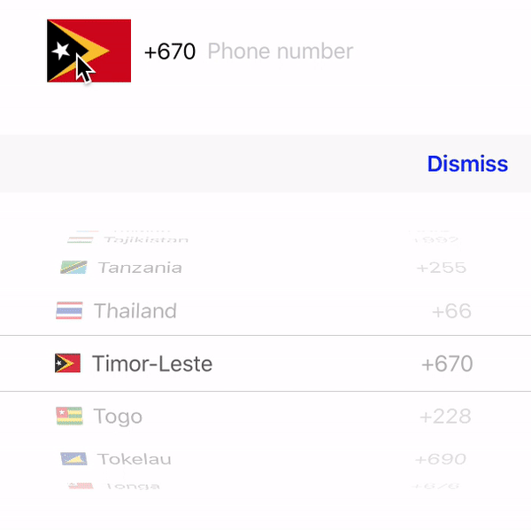

# FlagKits

[](https://travis-ci.org/LGKKTeam/FlagKits)
[](http://cocoapods.org/pods/FlagKits)
[](http://cocoapods.org/pods/FlagKits)
[](http://cocoapods.org/pods/FlagKits)
[](https://github.com/Carthage/Carthage)

## Example

To run the example project, clone the repo, and run `pod install` from the Example directory first.



## Requirements

* iOS: 9.0

## Usage


## Installation

### CocoaPods

FlagKits is available through [CocoaPods](http://cocoapods.org). 

To install it, simply add the following line to your Podfile:

```ruby
source 'https://github.com/CocoaPods/Specs.git'
platform :ios, '9.0'
use_frameworks!

pod 'FlagKits'
```

Then run the following command:

```bash
$ pod install
```

### Carthage
[Carthage](https://github.com/Carthage/Carthage) is a simple, decentralized dependency manager for Cocoa.

Specify Eureka into your project's `Cartfile`:


```ogdl
github "LGKKTeam/FlagKits"
```

### Manually as Embedded Framework

* Clone FlagKits as a git [submodule](http://git-scm.com/docs/git-submodule) by running the following command from your project root git folder.

```bash
$ git submodule add https://github.com/LGKKTeam/FlagKits.git
```

* Open FlagKits folder that was created by the previous git submodule command and drag the FlagKits.xcodeproj into the Project Navigator of your application's Xcode project.

* Select the FlagKits.xcodeproj in the Project Navigator and verify the deployment target matches with your application deployment target.

* Select your project in the Xcode Navigation and then select your application target from the sidebar. Next select the "General" tab and click on the + button under the "Embedded Binaries" section.

* Select `FlagKits.framework` and we are done!

## Getting involved

* If you **want to contribute** please feel free to **submit pull requests**.
* If you **have a feature request** please **open an issue**.
* If you **found a bug** check older issues before submitting an issue.
* If you **need help** or would like to **ask general question**, feel free contact with me via [email](nguyenminhkhmt@gmail.com)

## Author

* [Nguyen Minh](https://github.com/nguyenminhkhmt) [Email] (nguyenminhkhmt@gmail.com)

## License

FlagKits is available under the MIT license. See the LICENSE file for more info.
